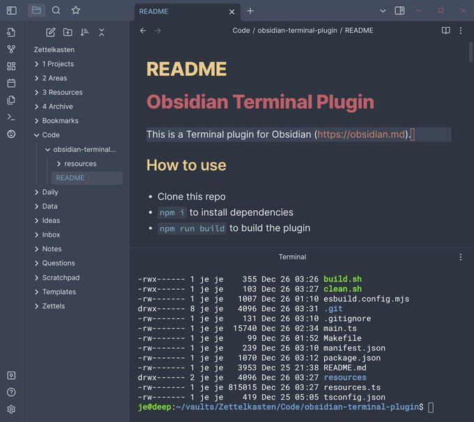

# Obsidian Terminal Plugin

This is a Terminal plugin for Obsidian (https://obsidian.md).

## How to use

- Clone this repo
- `npm i` to install dependencies
- `npm run build` to build the plugin

Copy main.js, manifest.json and the resources directory to:

PATH/TO/VAULT/.obsidian/plugins/obsidian-terminal-plugin

## Dependencies

The PTY helper (`resources/pty-helper.py`) requires Python 3 to be installed.
It has only been tested under Linux so far, but should work on macOS as well.
It would be possible to adapt the Terminal plugin to work under Windows as
well, but as it is not something that I have use for myself I probably won't
spend time on that. Pull requests are welcome!

Note that the reason that I don't use the node-pty module is that because it is
using a non-context aware native (compiled) Node module, which is not allowed
to be loaded within recent Electron versions.

The PTY helper uses file descriptor 3 to communicate terminal size changes.

## Notes

Two commands are added, one to open a terminal, and one to open the active file
in a terminal based editor. The default is set to /usr/bin/nvim, since Neovim
is obviously the best option. ;) To use a different editor, just change it in
the plugin settings within Obsidian.

My personal bindings are CTRL-E to open the file in Neovim and ALT-Enter to
spawn a shell, which works very well for my purposes.

Both of these bindings are bound to other actions in the default Obsidian
settings though (ALT-Enter is bound to follow link under cursor and CTRL-E is
bound to toggle edit/preview mode), so I am leaving it up to the user to set
suitable keyboard bindings (or just stick to invoking the actions with the
command palette using CTRL-P instead)

Note that when a Terminal or terminal based Editor view is focused, all
keypresses will be handled by the terminal. To shift focus back to Obsidian in
order to use Obsidian shortcuts you can either obviously just click somewhere
else, but also for convenience the tab group above the terminal/editor will be
focused with ALT-Esc.

## Settings

In the plugin settings, you can configure the following:

- Path to your editor
- Name of Terminal font
- Hide the tab group header
- Hide the status bar

I've included the Roboto Mono Nerd Font, that is already patched with support
for a large number of glyphs/icons. If you want to use another font that is
already loaded within Obsidian, just change the setting to the name of the
font, and if you want to use a font that is not included, add it to the
resources directory and edit the TerminalPlugin.onload() function to load it in
the same way that Roboto Mono is loaded right now.

A potential improvement would be to enumerate the files in the resources
directory and automatically load any .ttf font. Note that I want to avoid using
filesystem operations though, since that assumes the vault is using the
FileSystemAdapter, which is not the case on mobile platforms.

The plugin is desktop-only at the moment, since it relies on the PTY helper
script, but in the future it would be possible to add support for connecting to
a remote terminal over a websocket instead for instance.

Right now I've made the choice to simply always open the terminal/editor in a
split below the currently active one, and by default I'm hiding the tab group
header since I personally think it's just extra clutter in the cases when I'm
opening up a terminal and/or a terminal-based editor for the current file.

I am open for the fact that other people might have different preferences, so
if someone wants to work on making this more flexible, feel free to do it and
send a pull request.

Also I added an option to hide the global status bar. This is also more of a
personal preference, so I have set it to false by default, but I think it might
appeal to other people that prefer a clutter free environment in general. Just
toggle it in the plugin settings if you like to use this feature.
